# 🔐 Cyber Threat Landscape: Data-Driven Analysis and Strategic Insights

---

## 📘 Overview

This repository presents a comprehensive analysis of a real-world cybersecurity dataset, with a focus on identifying patterns, vulnerabilities, and behavioral trends in cyberattacks. Through the use of visual analytics and statistical examination, the project offers strategic insights to improve threat detection and guide proactive defense mechanisms.

---

## 🗂️ Dataset Overview

The dataset captures detailed records of network activity, including normal and anomalous behaviors. Key features include:

- **Timestamp** – Event date and time  
- **Source/Destination IP** – Origin and target of traffic  
- **Ports** – Source and destination ports involved in communication  
- **Protocol** – Network protocol used (e.g., TCP, UDP, ICMP)  
- **Packet Metadata** – Length, type, traffic category  
- **Payload Data** – Content extracted from packets  
- **Anomaly Score** – Numerical score indicating likelihood of abnormal behavior  
- **Severity Level** – Classification of event impact  
- **Log Source** – System generating the alert (e.g., Firewall, Server)  
- **Temporal Features** – Derived attributes such as year, month, hour

**Dataset Composition:**  
Contains 33 columns offering a multidimensional view of network and attack characteristics.

---

## 📊 Visual Analytics & Key Insights

### 1. 🔎 Top Source IPs
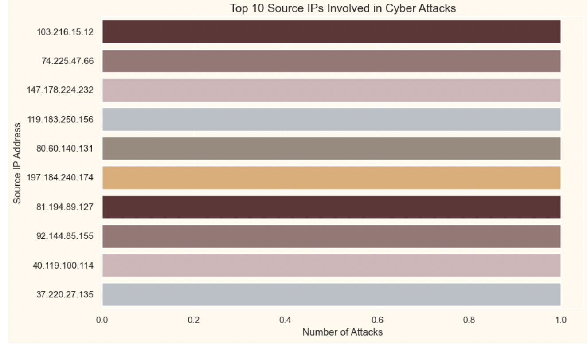  
- IP `103.216.15.12` is the most frequent attacker, suggesting a focus for immediate blocking.
- Attack activity is distributed, highlighting multiple threat actors.

### 2. 🎯 Most Targeted Destination Ports
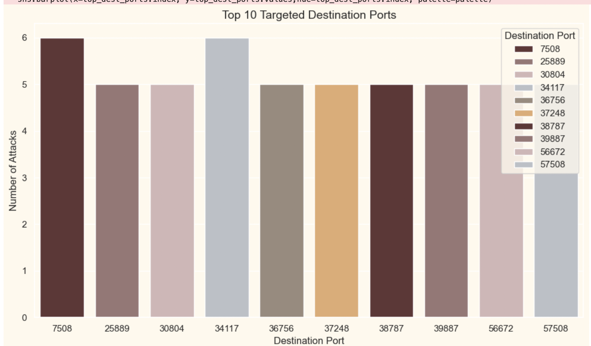  
- Ports 7508 and 25889 are highly targeted — potentially vulnerable services.
- Balanced distribution shows broad threat coverage across services.

### 3. 🧮 Packet Length Distribution
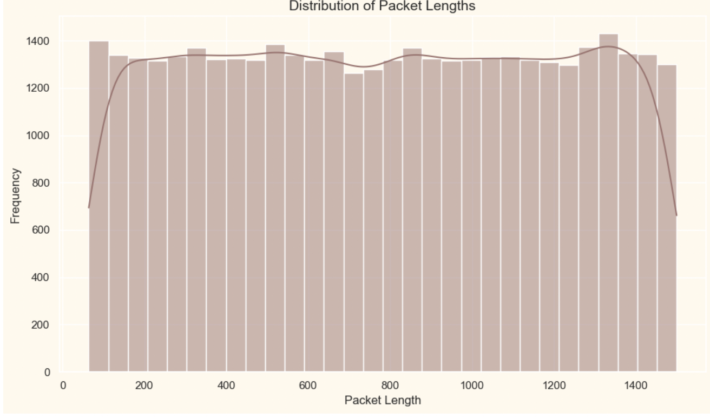  
- Median-centered distribution with minimal outliers suggests consistent traffic.
- Edge peaks may signal specific malicious payloads.

### 4. 🛡️ Attack Types by Severity
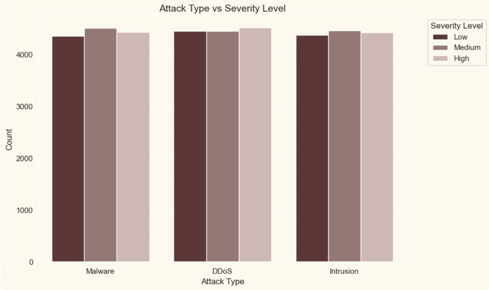  
- DDoS attacks are more likely to cause severe damage.
- Intrusions are common across all severity tiers.

### 5. ⏰ Hourly Attack Trends
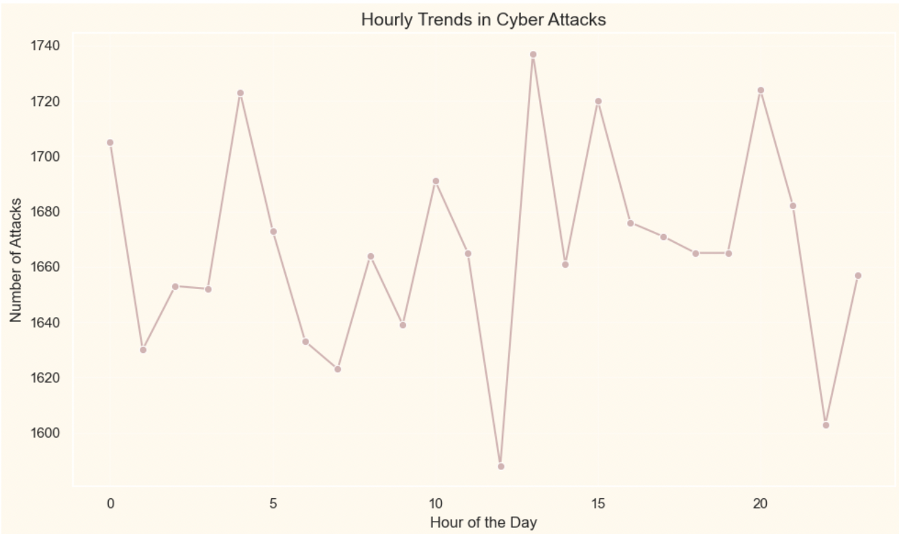  
- Activity peaks align with working hours — suggesting automated attack scripts.
- Lowest activity observed during late-night periods.

### 6. 🚨 Anomaly Score Distribution by Severity
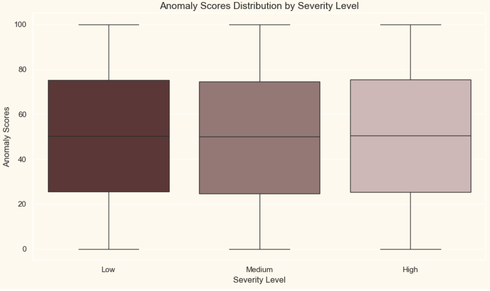  
- Strong correlation between anomaly scores and event severity.
- High outliers in lower severity levels may require model tuning.

### 7. 🌐 Top Attacked Network Segments
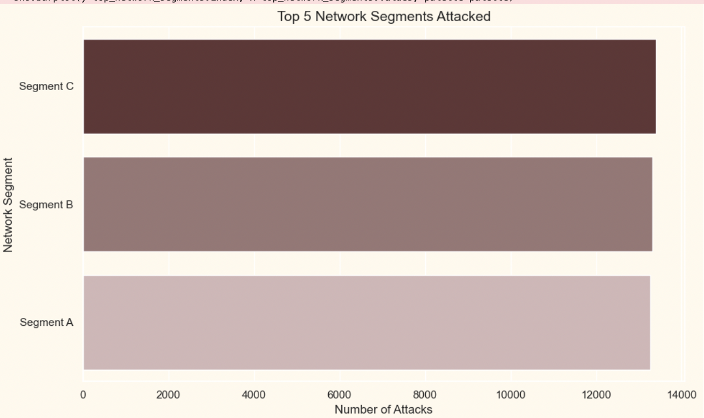  
- Segment C is most vulnerable, followed closely by others.
- Risk is distributed across multiple network zones.

### 8. 📅 Month-wise Attack Patterns
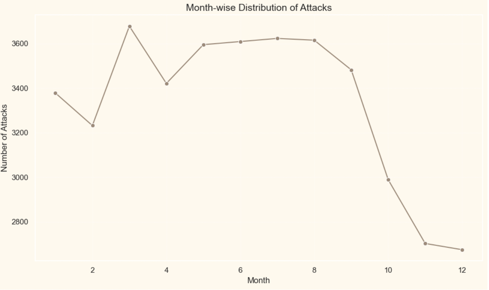  
- February and April see attack spikes — possibly due to coordinated global campaigns.
- Seasonal trends suggest defense focus in Q1 and Q2.

### 9. ⚠️ Alerts Breakdown
  
- ~50% warnings suggest effective detection, but potential false positives.
- Balanced distribution indicates mature monitoring.

### 10. 🌐 Traffic Type Analysis
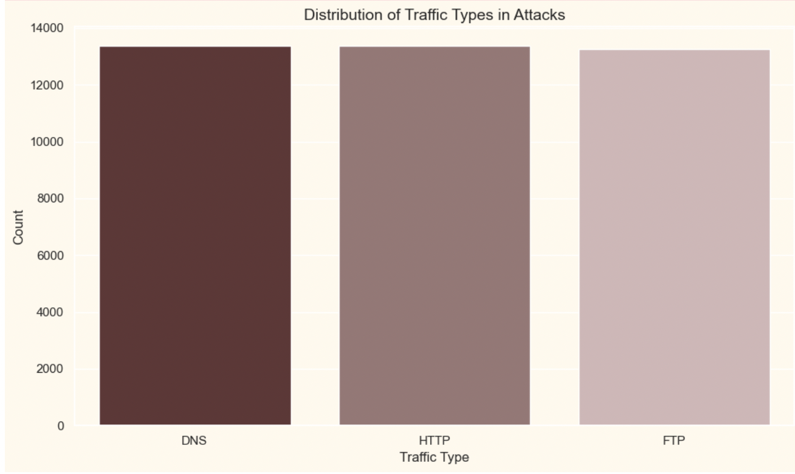  
- DNS and HTTP are prime vectors for malicious activity.
- FTP attacks also present, showing need for legacy protocol monitoring.

### 11. 🌍 Browser-Specific Attack Distribution
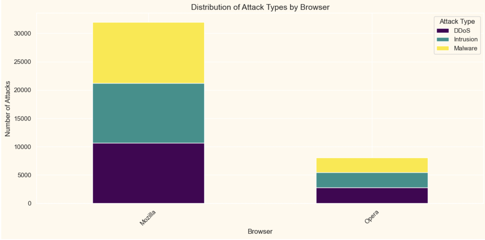  
- Mozilla browsers face higher threat levels.
- Malware is the most dominant attack vector across platforms.

### 12. 💻 OS/Device-Level Attack Trends
  
- Windows systems are top targets, especially for malware.
- Linux and macOS show vulnerability to intrusions.

### 13. 🔧 Response Actions
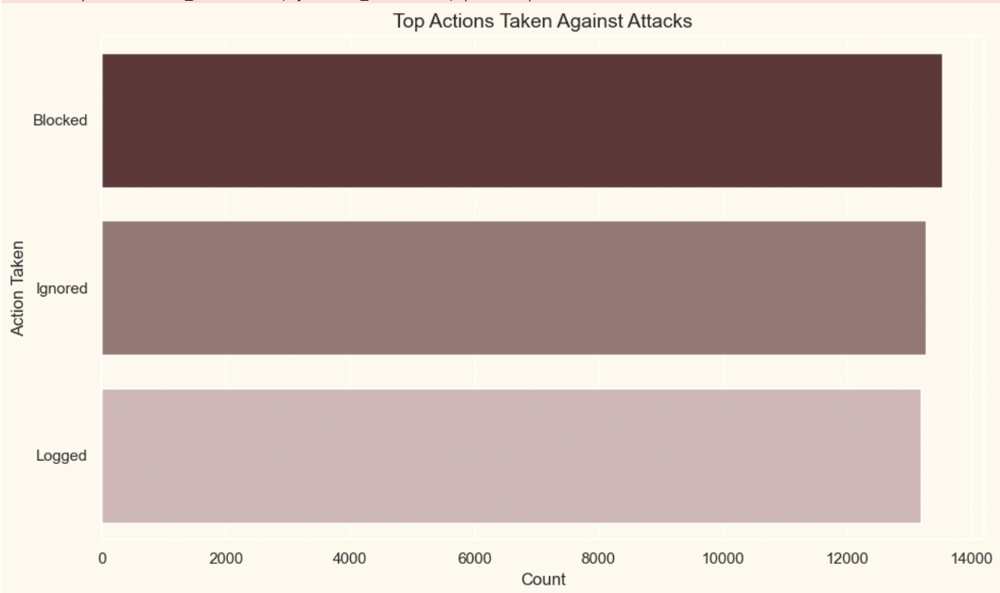  
- Logging is most common; blocking is used in critical cases.
- Ignored events may indicate refined thresholding or false positives.

### 14. 📡 Protocol Usage Patterns
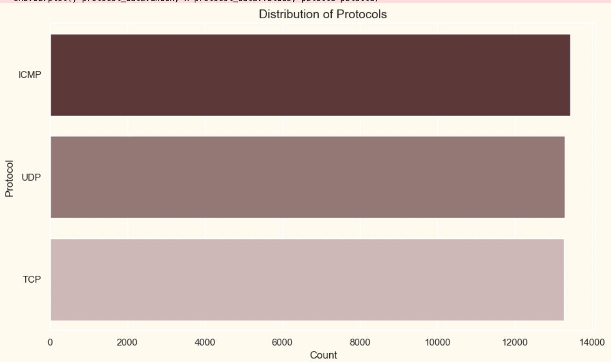  
- ICMP dominates, followed by UDP.
- TCP appears less, likely used in specific control scenarios.

### 15. 🗺️ Most Affected States
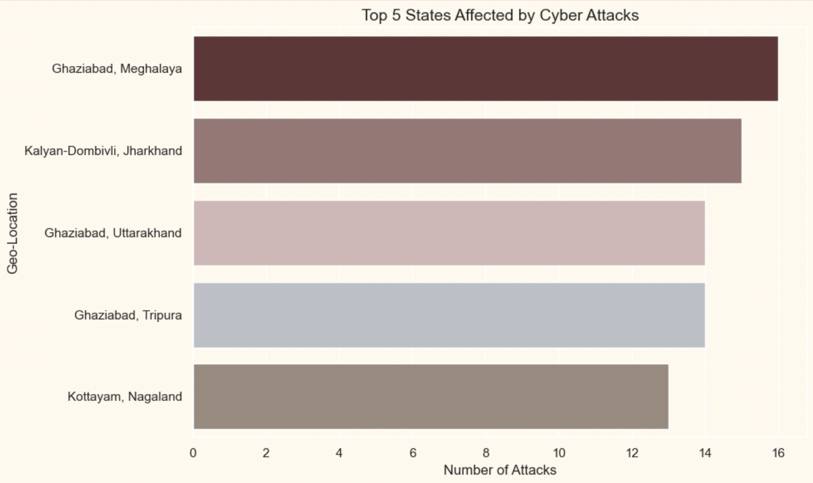  
- Ghaziabad and Meghalaya face intense attack volumes.
- Smaller states are also highly impacted — requiring better regional defenses.

### 16. 📈 Monthly Avg. Packet Length by Traffic Type
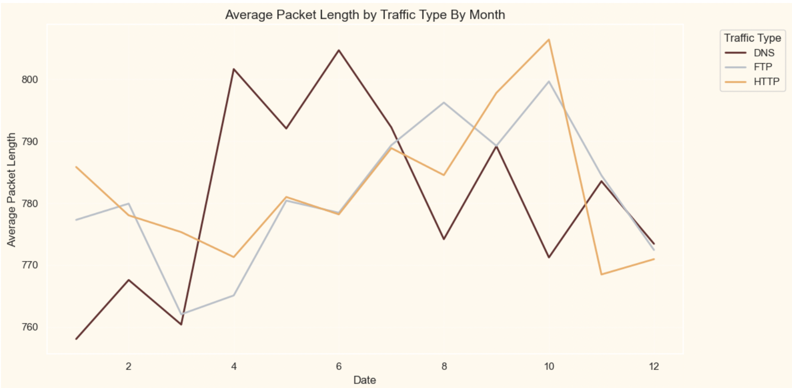  
- DNS shows seasonal spikes.
- HTTP remains stable; FTP is highly inconsistent.

### 17. 📅 Yearly Avg. Packet Length by Traffic Type
  
- DNS payload size increases yearly — likely due to query complexity.
- FTP usage varies, possibly reflecting inconsistent load.

---

## ⚙️ Methodology

1. **Data Preparation**
   - Cleaned and standardized all records
   - Addressed missing and inconsistent values

2. **Feature Engineering**
   - Created temporal and behavioral features for deeper insights

3. **Visualization**
   - Used Matplotlib and Seaborn for exploratory visualizations

4. **Analysis & Interpretation**
   - Data storytelling to guide defense strategies and detection tuning

---

## 🧠 Key Takeaways

- Persistent threats originate from a handful of high-risk IPs and ports.
- Cyberattack activity follows predictable temporal patterns.
- Severity is effectively predicted by anomaly scores.
- DNS and HTTP remain major attack vectors across protocols and platforms.

---

## 🛡️ Recommendations

1. **Monitor High-Risk Sources:** Implement IP blacklists and port-based firewall rules.
2. **Strengthen Vulnerable Segments:** Ensure regular audits across all network zones.
3. **Update Browsers & Protocols:** Maintain secure software versions to reduce exposure.
4. **Enhance Anomaly Detection:** Improve thresholds to reduce false positives and catch outliers.

---

